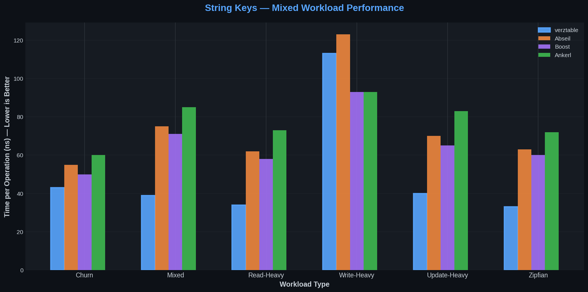

# ⚡ verztable

**A high-performance hash table for Zig that outperforms Google's Abseil, Boost, and Ankerl on mixed workloads.**

[](https://ziglang.org/)
[](LICENSE)
[](https://github.com/ThobiasKnudsen/verztable/actions)

### Key Features
- 🏆 **Beats Swiss Tables** on string keys and mixed workloads
- 🗑️ **Tombstone-free deletion** — performance doesn't degrade after millions of deletes
- 🔬 **SIMD-accelerated iteration** — vectorized metadata scanning
- 📦 **Unified API** — same type works as map and set
- ⚡ **Hash fragment filtering** — skips 15/16 of key comparisons on collisions



<details>
<summary><strong>📊 Detailed Benchmark Tables</strong></summary>

string keys — Average across all value-sizes and table-sizes (9 configurations) for all mixed workloads:
```
  ┌────────────────┬──────────────┬──────────┬──────────┬──────────┬───────────────────┐
  │ Operation      │ verztable    │ Abseil   │ Boost    │ Ankerl   │ std.StringHashMap │
  ├────────────────┼──────────────┼──────────┼──────────┼──────────┼───────────────────┤
  │ Churn          │        43 ns │    55 ns │    50 ns │    60 ns │             50 ns │
  │ Mixed          │        39 ns │    75 ns │    71 ns │    85 ns │             39 ns │
  │ Read-Heavy     │        34 ns │    62 ns │    58 ns │    73 ns │             30 ns │
  │ Write-Heavy    │       113 ns │   123 ns │    93 ns │    93 ns │             91 ns │
  │ Update-Heavy   │        40 ns │    70 ns │    65 ns │    83 ns │             41 ns │
  │ Zipfian        │        33 ns │    63 ns │    60 ns │    72 ns │             29 ns │
  └────────────────┴──────────────┴──────────┴──────────┴──────────┴───────────────────┘ 
```
u64 keys — Average across all value-sizes and table-sizes (9 configurations) for all mixed workloads:
```
  ┌────────────────┬──────────────┬──────────┬──────────┬──────────┬─────────────┐
  │ Operation      │ verztable    │ Abseil   │ Boost    │ Ankerl   │ std.HashMap │
  ├────────────────┼──────────────┼──────────┼──────────┼──────────┼─────────────┤
  │ Churn          │        17 ns │    25 ns │    20 ns │    23 ns │       29 ns │
  │ Mixed          │        12 ns │    13 ns │    10 ns │    17 ns │       15 ns │
  │ Read-Heavy     │         7 ns │     5 ns │     6 ns │    12 ns │       10 ns │
  │ Write-Heavy    │        35 ns │    30 ns │    29 ns │    29 ns │       28 ns │
  │ Update-Heavy   │        14 ns │    12 ns │    12 ns │    18 ns │       16 ns │
  │ Zipfian        │         9 ns │    12 ns │     9 ns │    16 ns │       11 ns │
  └────────────────┴──────────────┴──────────┴──────────┴──────────┴─────────────┘ 
```

</details>

Run `zig build benchmark` to reproduce a comprehensive benchmark, or see [BENCHMARKS.md](BENCHMARKS.md).

## Why verztable?

- **Fast lookups impervious to load factor** — Hash fragment filtering skips non-matches without touching bucket data
- **Tombstone-free deletion** — No performance degradation after millions of deletes  
- **Unified API** — Same type works as both map (`HashMap(K, V)`) and set (`HashMap(K, void)`)
- **SIMD iteration** — Vectorized metadata scanning for fast traversal
- **Zero-cost generics** — Comptime-specialized for each key/value type

**Trade-off**: Uses ~25% more memory than competitors in exchange for consistent performance. Tunable via `setMaxLoadFactor()`.

## Installation

Add to your `build.zig.zon`:

```zig
.dependencies = .{
    .verztable = .{
        .url = "https://github.com/ThobiasKnudsen/verztable/archive/refs/tags/v0.1.0.tar.gz",
        .hash = "...", // Run: zig fetch --save <url>
    },
},
```

Then in your `build.zig`:

```zig
const verztable = b.dependency("verztable", .{});
exe.root_module.addImport("verztable", verztable.module("verztable"));
```

## Quick Start

### Map (key → value)

```zig
const std = @import("std");
const HashMap = @import("verztable").HashMap;

var map = HashMap(u32, []const u8).init(allocator);
defer map.deinit();

// Insert
try map.put(42, "answer");

// Lookup
if (map.get(42)) |val| {
    std.debug.print("{s}\n", .{val}); // "answer"
}

// Update
try map.put(42, "new answer");

// Remove
_ = map.remove(42);
```

### Set (V = void)

When V is `void`, the HashMap becomes a set with zero value storage overhead:

```zig
var set = HashMap([]const u8, void).init(allocator);
defer set.deinit();

// Add elements
try set.add("apple");
try set.add("banana");

// Check membership
if (set.contains("apple")) {
    std.debug.print("found!\n", .{});
}

// Remove
_ = set.remove("apple");
```

### Accumulation with getOrPut

```zig
var freq = HashMap([]const u8, u32).init(allocator);
defer freq.deinit();

for (words) |word| {
    const result = try freq.getOrPut(word);
    if (!result.found_existing) {
        result.value_ptr.* = 0;
    }
    result.value_ptr.* += 1;
}
```

### Iteration

```zig
// Over buckets (key + value)
var iter = map.iterator();
while (iter.next()) |bucket| {
    std.debug.print("{}: {}\n", .{ bucket.key, bucket.val });
}

// Over keys only
var key_iter = map.keyIterator();
while (key_iter.next()) |key| {
    // ...
}

// Over values only
var val_iter = map.valueIterator();
while (val_iter.next()) |val| {
    // ...
}
```

### Configuration

```zig
var map = HashMap(u32, u32).init(allocator);

// Adjust load factor (default: 0.875)
map.setMaxLoadFactor(0.75);

// Pre-allocate for expected size
try map.reserve(1000);

// Shrink to fit current size
try map.shrink();

// Clone
var map2 = try map.clone();
```

### Custom Hash Functions

```zig
const HashMapWithFns = @import("verztable").HashMapWithFns;

const MyHash = struct {
    fn hash(key: MyKey) u64 { ... }
};
const MyEql = struct {
    fn eql(a: MyKey, b: MyKey) bool { ... }
};

var map = HashMapWithFns(MyKey, MyValue, MyHash.hash, MyEql.eql).init(allocator);
```

## Algorithm

```
┌─────────────────────────────────────────────────────────────┐
│ Metadata Array (2 bytes per bucket)                         │
│ ┌──────────┬──────────┬──────────┬──────────┬─────┐         │
│ │ frag(4b) │ frag(4b) │ frag(4b) │ frag(4b) │ ... │ ← SIMD  │
│ │ home(1b) │ home(1b) │ home(1b) │ home(1b) │     │   scan  │
│ │ disp(11b)│ disp(11b)│ disp(11b)│ disp(11b)│     │         │
│ └──────────┴──────────┴──────────┴──────────┴─────┘         │
│                          ↓                                  │
│ Bucket Array (key + value, separate allocation)             │
│ ┌──────────┬──────────┬──────────┬──────────┬─────┐         │
│ │ key, val │ key, val │ key, val │ key, val │ ... │         │
│ └──────────┴──────────┴──────────┴──────────┴─────┘         │
└─────────────────────────────────────────────────────────────┘
```

Open-addressing with linear probing and linked chains per home bucket:

- **16-bit metadata per bucket**: 4-bit hash fragment | 1-bit home flag | 11-bit displacement
- Keys belonging to the same bucket form traversable chains
- Chains always start at their home bucket (evicting non-belonging keys if needed)
- Fast lookups: hash fragment filtering skips non-matches without accessing bucket data

## API Reference

### Types
- `HashMap(K, V)` — Hash table with auto-detected hash/eql functions
- `HashMapWithFns(K, V, hashFn, eqlFn)` — Hash table with custom functions

### Map Methods (V != void)

| Method | Description |
|--------|-------------|
| `put(key, value)` | Insert or update |
| `putNoClobber(key, value)` | Insert only if not exists, returns bool |
| `get(key)` | Returns `?V` |
| `getPtr(key)` | Returns `?*V` for modification |
| `getOrPut(key)` | Returns `{value_ptr, found_existing}` |
| `getEntry(key)` | Returns `?{key_ptr, value_ptr}` |

### Set Methods (V == void)

| Method | Description |
|--------|-------------|
| `add(key)` | Add to set |
| `contains(key)` | Returns bool |

### Common Methods

| Method | Description |
|--------|-------------|
| `remove(key)` | Remove, returns bool |
| `clear()` | Remove all entries |
| `count()` | Number of entries |
| `capacity()` | Current capacity |
| `bucketCount()` | Number of buckets |
| `reserve(n)` | Pre-allocate for n entries |
| `shrink()` | Shrink to fit |
| `clone()` | Deep copy |
| `iterator()` | Iterate over buckets |
| `keyIterator()` | Iterate over keys |
| `valueIterator()` | Iterate over values (maps only) |
| `setMaxLoadFactor(f)` | Set load factor (0.1–0.99) |

## Benchmarks

Run the benchmark suite comparing verztable against Abseil, Boost, Ankerl, and Zig's std hash maps:

```bash
zig build benchmark
```

See [BENCHMARKS.md](BENCHMARKS.md) for detailed results across different key types and sizes.

### Benchmarking Notes

- All C++ hash tables use `std::string_view` (non-owning) for string keys, matching Zig's `[]const u8` semantics
- All libraries use wyhash for string hashing to ensure a fair comparison
- verztable has a fast-path for strings ≤8 bytes (packed into u64) that competitors don't use
- verztable stores full 64-bit hashes for string keys to skip `memcmp` on hash-fragment matches
- Benchmarks use FFI to interface with C++ hash tables, which can add some overhead (though Ankerl's 0ns iterations suggest minimal impact)
- All benchmarks run with `ReleaseFast` optimization

## License

MIT License — see [LICENSE](LICENSE)

## Credits

Algorithm design inspired by [Verstable](https://github.com/JacksonAllan/Verstable) by Jackson Allan.
